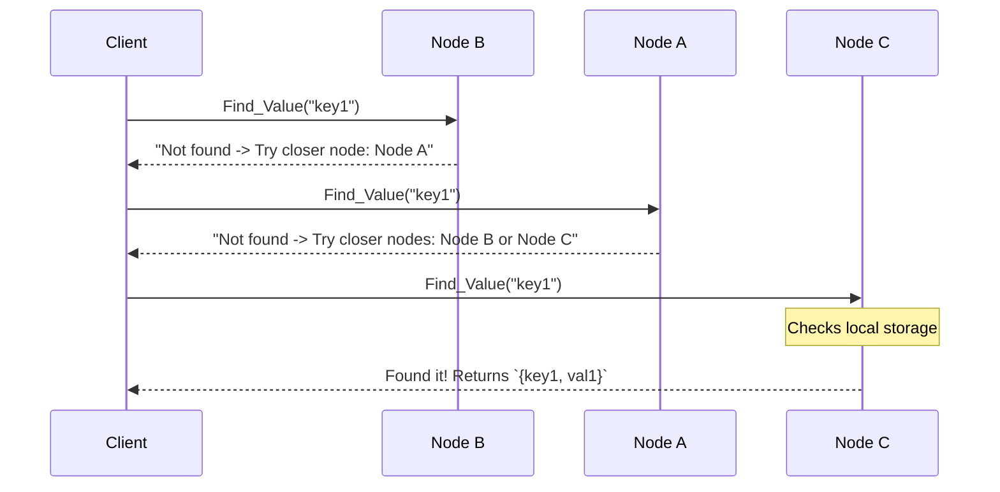

# Building a DHT in Go from Scratch: A Deep Dive into Kademlia Paper 🚀

Hey everyone! 👋, Have you ever wondered how decentralized systems like BitTorrent, IPFS, or blockchain networks manage to find and store data without a centralized server? The secret sauce is almost always a **Distributed Hash Table (DHT)**.

Today, we're not just going to talk about theory. We are going to **build a functional, minimal DHT from scratch in Go**. By the end of this read, you'll have a working peer-to-peer network routing data intelligently using the famous **Kademlia architecture**.

Grab a coffee ☕, fire up your code editor, and let's dive deep into distributed systems engineering!

> **Prerequisite:** To code along, you should have a basic understanding of RPCs (Remote Procedure Calls). We will use **gRPC over TCP** for ease of debugging, but you are free to use any transmission protocol of your choice (like HTTP, WebSockets, or plain UDP as referenced in the original paper). If you want to brush up on gRPC, [read this excellent guide](https://dev.to/pixperk/learn-grpc-completely-from-unary-to-bi-directional-rpcs-2dnl).
> 
> 💻 **Source Code:** You can find the complete, runnable code for this project on GitHub: **[Aryan123-rgb/go-dht](https://github.com/Aryan123-rgb/go-dht)**.

---

## Table of Contents
- [1. What Exactly is a DHT? (And How is it Different?)](#1-what-exactly-is-a-dht-and-how-is-it-different)
- [2. The Core Concepts of Kademlia](#2-the-core-concepts-of-kademlia)
- [3. Project Setup](#3-project-setup)
- [4. Step 1: The Protocol (gRPC Definitions)](#4-step-1-the-protocol-grpc-definitions)
- [5. Step 2: The Math Engine (routing_table.go)](#5-step-2-the-math-engine-routing_tablego)
- [6. Step 3: The Passive Server (server.go)](#6-step-3-the-passive-server-servergo)
- [7. Step 4: The Network Client (client.go)](#7-step-4-the-network-client-clientgo)
- [8. Step 5: Wiring it all together (main.go)](#8-step-5-wiring-it-all-together-maingo)
- [9. Demo Time! 🎉](#9-demo-time-)
- [10. Concepts Not Implemented (Production Considerations)](#10-concepts-not-implemented-production-considerations)
- [Conclusion](#conclusion)

---

## 1. What Exactly is a DHT? (And How is it Different?)

Before writing anything, let's clear up what a DHT actually is and what makes it special.

If you've worked with databases like Redis, you know them as "Distributed Key-Value Stores." You send a key (`"user:123"`) and get a value (`"Alice"`). If you haven't heard of them, that's fine just picture that the data is not stored in a single server but is split up and stored across multiple servers. In traditional distributed stores, however, there's usually a central coordinator or a highly consistent cluster that handles the routing, storing, and fetching of key-values.

A **Distributed Hash Table** does the exact same thing (stores and retrieves data), but operates in a **peer-to-peer (P2P)** environment where:

- There is **no master node** or central coordinator.
- Nodes can join and leave the network freely at any time (we call this environment "high churn").
- No single node has the full map of the network. A node only knows about a tiny fraction of its peers.

## 2. The Core Concepts of Kademlia

To code Kademlia, we need to understand its three foundational pillars:

### The Unified 160-bit ID Space

In Kademlia, _everything_ is located using a 160-bit identifier (we will use SHA-1 to generate it). This applies to both nodes and data keys! We store nodes using their SHA-1 hash, but we represent the secret keys as simple strings before hashing them under the hood. Why? Because it makes the CLI much easier to use. 😅

Because both nodes and data live in the _exact same mathematical space_, it means a node and a piece of data can be mathematically "close" to one another.

### The XOR Distance Metric

_Pay a little attention here. The original paper describes this using a binary tree, but in actual code implementations, you won't find a literal binary tree data structure!_ 😅

So how do we know which node should store which piece of data? Kademlia says:

> **Data should be stored on the nodes whose IDs are mathematically closest to the data's ID**

But how do you measure "distance" between two 160-bit hashes? They aren't physical locations like latitude and longitude.

Kademlia uses the bitwise **XOR operator ($\oplus$)** to define distance.
The distance between Node A and Key B is:
$$Distance = Node\_ID \oplus Key\_ID$$

XOR is a magical operator for this specific use case because:
1. **Distance to yourself is zero**: $A \oplus A = 0$.
2. **It's symmetric**: $A \oplus B = B \oplus A$ (distance from A to B is the same as B to A).
3. **It obeys the triangle inequality**: Logically, distances act like straight lines.

### Routing Tables & Buckets

Because the ID space is 160 bits long, Kademlia maintains a routing table organized into exactly 160 "buckets."

- **Bucket 0** stores nodes whose XOR distance is 1 bit away.
- **Bucket 159** stores nodes whose XOR distance is on the total opposite side of the ID space.

Because of this structure, a node knows _a lot_ about its immediate mathematical neighbors, and only a _little_ about nodes far away.

If you are reading the original Kademlia paper, do not get scared by the complex bucket tree diagrams! In code, it simply means:
Nodes whose IDs differ at the 0th bit (from the left/Most Significant Bit) get stored in `routing_table[0]`. Nodes whose bits differ at the 1st bit are stored at `routing_table[1]`, and so on.


### Communication Across Nodes

Kademlia dictates that nodes only need four Remote Procedure Calls (RPCs) to operate the entire network:

1. **Ping**: Used to check whether a peer is alive or not.
2. **Store (key, value)**: Hashes the key and stores the data to the peers mathematically closest to that hash according to the XOR metric.
3. **Find_Node (node_id)**: Asks a peer to find all known nodes closest to the target Node ID.
4. **Find_Value (key)**: Asks a peer for the data corresponding to a key. If they don't have it, they act exactly like `Find_Node` and return the closest known nodes.

During these gRPC calls, the receiver **always** saves the sender's ID. This is how peer-to-peer passive discovery works! 

In simple terms: when Node A calls Node B, Node B remembers Node A. When a new Node C comes along and calls Node A, Node A learns about Node C. This organic gossip is how inter-node network mapping functions.

### The Iterative Key Lookup (Finding Data Organically)

Because we don't use complete network "flooding", we perform an **Iterative Lookup** to find data. Rather than a central coordinator sending you the data, you traverse the network by asking peers who they know. 

Let's look at a practical example. Imagine this network state:
*   **Node A's Routing Table (Buckets):** knows about `Node B` and `Node C`.
*   **Node B's Routing Table (Buckets):** knows about `Node A`.
*   **Node C's Routing Table (Buckets):** knows about `Node A`.
*   **Data Storage:** A key-value pair `{key1, val1}` is stored locally on **Node C**.

**The Query Flow:**
If a client connects to **Node B** to query `key1`, here is how Kademlia routes the request without any central directory:

1.  **Query Node B:** The client asks Node B for `key1`.
2.  **Node B Checks Local Storage:** Node B does not have it. It looks in its routing table and returns the closest peer it knows: **Node A**.
3.  **Query Node A:** The client uses this new information and asks Node A for `key1`.
4.  **Node A Checks Local Storage:** Node A does not have it. It looks in its routing table and returns the closest peers it knows: **Node B** and **Node C**.
5.  **Query Node C:** Since the client already asked Node B, it now routes the query to **Node C** and asks for `key1`.
6.  **Node C Checks Local Storage:** Node C looks in its database, finds `{key1, val1}`, and returns the value to the client!

Here is a visual representation of this iterative routing process:



Through this process, the client "homes in" on the target data by jumping closer and closer mathematically across the buckets until it hits the final destination node storing the data.

---

## 3. Project Setup

Let's start coding.

Our ideal project layout looks like this:
```text
/go-dht
├── proto/             # gRPC definitions
│   └── dht.proto
├── server.go          # The passive listener & storage
├── client.go          # The active worker (Network routing)
├── routing_table.go   # XOR distances and Bucket logic
└── main.go            # Entrypoint and CLI UI
```

---

## 4. Step 1: The Protocol (gRPC Definitions)

Kademlia dictates that nodes only need four Remote Procedure Calls (RPCs) to operate the entire network. Let's define them in `proto/dht.proto`.

Instead of one giant block, let's look at the service definition first:

```protobuf
syntax = "proto3";
package dht;
option go_package = "./proto";

service DHT {
    rpc Ping(PingRequest) returns (PingResponse);
    rpc Store(StoreRequest) returns (StoreResponse);
    rpc FindNode(FindNodeRequest) returns (FindNodeResponse);
    rpc FindValue(FindValueRequest) returns (FindValueResponse);
}
```

- `FindNode` asks a peer: _"Look in your routing table. Who do you know that is mathematically closest to this target ID?"_
- `FindValue` asks: _"Do you have the data for this key? If not, act exactly like FindNode and give me someone closer."_

To support these, every message should include the sender's information for passive discovery:

```protobuf
message Node {
    bytes id = 1; // 160 bit SHA-1 Hash
    string ip_address = 2; // network address to connect via gRPC
}

message FindValueRequest {
    Node sender = 1;      // Let the receiver know who we are!
    string key = 2;       // The key we are looking for
}

message FindValueResponse {
    bytes value = 1;         // Populated if data is found
    repeated Node nodes = 2; // Populated with closer nodes if data NOT found
    bool found = 3; 
}
```
*(You can scaffold `StoreRequest`, `PingRequest`, etc., using the same logic—just ensure `Node sender = 1` is included!)*

Compile the proto file using:
```bash
protoc --go_out=. --go-grpc_out=. proto/dht.proto
```

---

## 5. Step 2: The Math Engine (`routing_table.go`)

We need a way to hash inputs to 160 bits and slot nodes into 160 distinct buckets.

First, standardizing the ID generation:

```go
const IDLength = 20             // 160 bits = 20 bytes
const MaxBuckets = IDLength * 8 // 160 buckets

type NodeId [IDLength]byte

func GenerateID(data string) NodeId {
	return sha1.Sum([]byte(data)) // Converts any string into a 160-bit hash!
}
```

### The Bucket Math
To place discovered nodes into our 160 buckets, we calculate the highest differing bit (the most significant bit that differs between our ID and the newly discovered node's ID).

```go
func BucketIndex(id1, id2 NodeId) int {
	for i := range IDLength {
		xor := id1[i] ^ id2[i]
		if xor != 0 {
			leadingZeros := bits.LeadingZeros8(xor)
			return (IDLength-1-i)*8 + (8 - 1 - leadingZeros)
		}
	}
	return 0 // IDs are exactly identical
}
```
If the IDs differ completely at the very first bit, it goes into Bucket 159. This organically sorts peers: distant nodes fall into one massive high-level bucket, and close nodes are tightly coupled into lower buckets.

### Saving the Nodes
Our `RoutingTable` is just an array of subsets (buckets):

```go
type RoutingTable struct {
	mu      sync.Mutex
	SelfId  NodeId
	Buckets [MaxBuckets][]*proto.Node
}

func (rt *RoutingTable) AddNode(node *proto.Node) {
	rt.mu.Lock()
	defer rt.mu.Unlock()

    // Find the mathematical distance bucket
	var id NodeId
	copy(id[:], node.Id)
    bucketIndex := BucketIndex(rt.SelfId, id)

	// Append them if they aren't completely identical to us or already present!
    // (Omitted duplicate check for brevity)
	rt.Buckets[bucketIndex] = append(rt.Buckets[bucketIndex], node)
}
```

---

## 6. Step 3: The Passive Server (`server.go`)

Every peer runs a gRPC server to answer queries. 

The most elegant feature here is **Passive Discovery**. Remember how every request in our protobuf file included the sender's info? Because of this, nodes organically build a map of the network just by servicing normal traffic. There is no central registry!

```go
type DHTServer struct {
	proto.UnimplementedDHTServer
	Self         *proto.Node
	RoutingTable *RoutingTable
	Storage      map[string][]byte  // Our "Database"
	storageMu    sync.Mutex
}
```

Let's look at `FindValue`. The absolute first thing the RPC does is record the sender:

```go
func (s *DHTServer) FindValue(ctx context.Context, req *proto.FindValueRequest) (*proto.FindValueResponse, error) {
    // 1. Passive Discovery! We learn about the sender for free.
	if req.Sender != nil {
         s.RoutingTable.AddNode(req.Sender) 
    }

    // 2. Check our Database
	s.storageMu.Lock()
	val, isExists := s.Storage[req.Key]
	s.storageMu.Unlock()

	if isExists {
        // We have the data!
		return &proto.FindValueResponse{Value: val, Found: true}, nil
	}

    // 3. We don't have it. Return our closest known peers to the target!
	nodes := s.RoutingTable.GetClosestNode()
	return &proto.FindValueResponse{Nodes: nodes, Found: false}, nil
}
```

Applying `Store` is even simpler. Record the sender, lock the map, and write the byte payload.

---

## 7. Step 4: The Network Client (`client.go`)

This is where the complex action happens! While the server passively listens, the `Client` actively hunts the network.

### Bootstrapping
How does a new node discover the whole network? You provide it just **one** known address (a bootstrap peer). The node connects to it and performs a `FindNode` request _looking for its own ID_.

By asking the network "Who is closest to me?", the peers return the nodes mathematically surrounding our new node, organically populating our empty routing table!

```go
func (c *Client) Bootstrap(bootstrapAddr string) {
	conn, _ := grpc.NewClient(bootstrapAddr, grpc.WithTransportCredentials(insecure.NewCredentials()))
	grpcClient := proto.NewDHTClient(conn)

    // Query for our OWN ID!
	req := &proto.FindNodeRequest{Sender: c.Self, TargetId: c.Self.Id}
	resp, _ := grpcClient.FindNode(context.Background(), req)

    // Add discovered peers to our table
	for _, node := range resp.Nodes {
		c.RoutingTable.AddNode(node)
	}
}
```

### Implementing Iterative Lookup

Now that we understand the core concept of iterative lookups from earlier, let's map the conceptual flow into actual Go code. 

**Phase 1: Setup**
We initialize our search state. We convert the string key into a 160-bit hash, create a map to track which nodes we have already queried (to prevent infinite loops), and initialize our "shortlist" with every node currently sitting in our Routing Table.

```go
func (c *Client) FindValueNetwork(key string) {
    // Check locally first...
	targetId := GenerateID(key)
	queried := make(map[string]bool)
	shortList := c.RoutingTable.GetClosestNode()
    // ...
```

**Phase 2: The Loop**
This is the heart of the mathematical routing computation. Inside an infinite loop, we sort our `shortList`. The custom sorting function calculates the XOR distance from each node's ID to the `targetId`. This forces the nodes mathematically "closest" to the data to bubble straight to the 0th index! We then iterate through the sorted list, skipping the ones we've already queried, and pick the optimal `nextNode`.

```go
	for {
		sort.Slice(shortList, func(i, j int) bool {
			// Sort based on XOR distance to the TargetId
			return isCloser(xorDistance(IdI, targetId), xorDistance(IdJ, targetId))
		})

		var nextNode *proto.Node
		for _, n := range shortList {
			if !queried[string(n.Id)] {
				nextNode = n
				break
			}
		}
```

**Phase 3: The Query**
Once we select the best unqueried node, we mark it as queried in our map to ensure we don't ask it again. We dial it via gRPC using `FindValue`. 
If it has the data (`Found: true`), we exit the loop! If it doesn't, it returns a list of *closer nodes* from its own routing table. We parse those new nodes, add them to our own `shortList` (if they aren't already there), and the loop starts entirely from the beginning—re-sorting the newly expanded list so we inch closer and closer to the target until we zero in!

```go
		queried[string(nextNode.Id)] = true
		resp, _ := grpcClient.FindValue(ctx, &proto.FindValueRequest{Sender: c.Self, Key: key})

		if resp.Found {
			log.Printf("Success! Value: '%s'", string(resp.Value))
			return
		}

		// Add newly discovered closer nodes to our shortlist!
		for _, n := range resp.Nodes {
			c.RoutingTable.AddNode(n)
			if !containsNode(shortList, n) {
				shortList = append(shortList, n)
			}
		}
	} // end for
}
```

*(Note: Storing data uses the exact same `for` loop routing logic. You iterate to find the closest node mathematically, and once you can't find anyone closer, you break the loop and send a `Store` RPC instead of querying `FindValue`.)*

---

## 8. Step 5: Wiring it all together (`main.go`)

To test our distributed system, we wrap everything in `main.go`. We initialize our Node Identity, spin up the background gRPC server, bootstrap if necessary, and launch a blocking CLI scanner to issue `store/get` commands.

```go
func main() {
	port := flag.String("port", "5001", "Port to listen on")
	bootstrap := flag.String("bootstrap", "", "Address of bootstrap node")
	flag.Parse()

	address := fmt.Sprintf("127.0.0.1:%s", *port)
	selfId := GenerateID(address)
	selfNode := &proto.Node{Id: selfId[:], IpAddress: address}

	rt := NewRoutingTable(selfId)
	server := NewDHTServer(selfNode, rt)
	client := NewClient(rt, server, selfNode)

	// Background listener
	lis, _ := net.Listen("tcp", address)
	grpcServer := grpc.NewServer()
	proto.RegisterDHTServer(grpcServer, server)
	go grpcServer.Serve(lis)

	if *bootstrap != "" {
		client.Bootstrap(*bootstrap)
	}

	// CLI Loop (omitted for brevity)
    // Listens for: `store key value`, `get key`, etc.
}
```

---

## 9. Demo Time! 🎉

We've built it! Let's watch logarithmic routing in action over an actual network.
Open three separate terminal windows in the project directory.

**Terminal 1 (Node A - Genesis Node):**
Starts the network. It knows nobody.
```bash
go run . --port 5001
```

**Terminal 2 (Node B):**
Connects to our network by bootstrapping to Node A (port 5001).
```bash
go run . --port 5002 --bootstrap 127.0.0.1:5001
```

**Terminal 3 (Node C):**
Also bootstraps via Node A (port 5001). Because of Kademlia's bootstrapping and passive discovery, Node A now knows about B and C, and B and C both know about A!
```bash
go run . --port 5003 --bootstrap 127.0.0.1:5001
```

Now, in **Terminal 3 (Node C)**, instruct it to store a key-value pair. We will simulate storing `{key1, val1}` locally on Node C:
```text
[Node C] ➜ store key1 val1
```
The client will hash `key1`, find the node ID mathematically closest to it across the three terminal networks, and execute the storage operation exactly there! Check the logs on the three terminals to see who actually stored it.

Then in **Terminal 2 (Node B)**, try to fetch it, mirroring our earlier iterative lookup example:
```text
[Node B] ➜ get key1
```
Watch the terminal output closely. Node B will realize it doesn't have the data locally. It will ask the network, querying Node A first. Once Node A points it closer to the target, it will process its shortlists, jump to the correct peer mathematically, and retrieve `{key1, val1}` securely! ✨

---

## 10. Concepts Not Implemented (Production Considerations)

If you take this code and deploy it to a BitTorrent swarm right now, it will work beautifully... until nodes start violently crashing.

To keep this tutorial clean for education, we omitted a few heavy production features:

1. **k-buckets with LRU Eviction**: Our `RoutingTable` holds unlimited nodes. Real Kademlia constrains buckets strictly to a max of $k$ nodes (often $k=20$) using Least-Recently Used (LRU) rules to ensure fast $\mathcal{O}(\log n)$ lookup complexity without bloating memory.
2. **UDP Protocol instead of TCP**: We used gRPC, which operates over TCP. Production DHTs (like Mainline DHT) almost exclusively use lightweight UDP packets. Connecting to hundreds of peers involves massive connection handshakes and socket limits under TCP. UDP is fire-and-forget, making routing lookups blazing fast.
3. **Data Replication ($k$ value)**: Currently, we `Store` data to the _single_ closest node. Real implementations replicate the `Store` command to the 20 nodes mathematically closest to the target hash. If someone unplugs their computer, the data survives.
4. **TTL and Periodic Republishing**: Nodes churn. The original publisher of the keyword must periodically run `.Store()` every hour to keep the data alive in the network before nodes flush it from their caches.
5. **Alpha Concurrency ($\alpha=3$)**: During our Iterative Lookup, we query the closest nodes sequentially. Production P2P clients query up to $\alpha$ (usually 3) nodes concurrently using multi-threading to vastly speed up discovery speeds.

---

## Conclusion

Congratulations! Building a DHT from scratch teaches you some of the most fascinating engineering patterns in existence. You've just shifted logic from tightly-coupled master/slave database relationships into chaotic, decentralized mathematical routing.

If you found this helpful, let me know in the comments! You can grab all the source code for this project and start tweaking the math yourself.

Happy coding, and go build the decentralized web! 🌐

---
**Personal Note:** Let's connect! I share more deep dives on building distributed systems and backend engineering on X.
Follow me: [@distroaryan](https://x.com/distroaryan)

_(Drop your thoughts or questions below—have you ever built or worked with a P2P system before?)_
